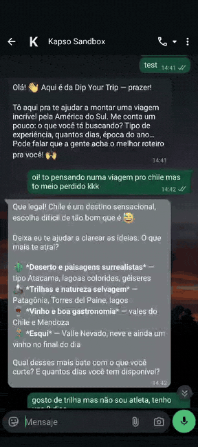
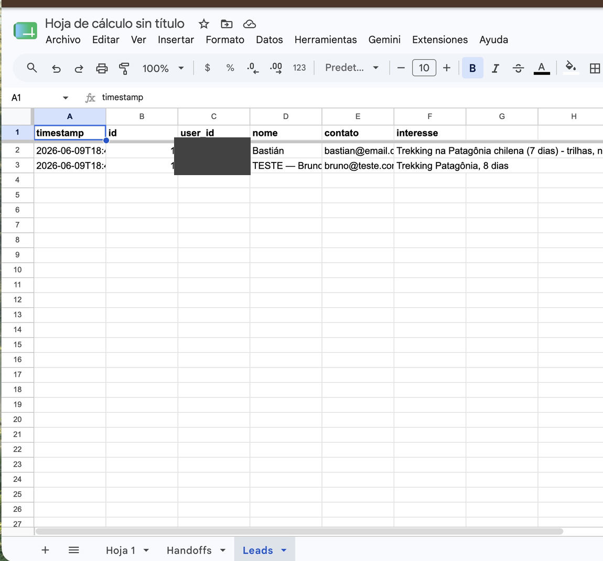
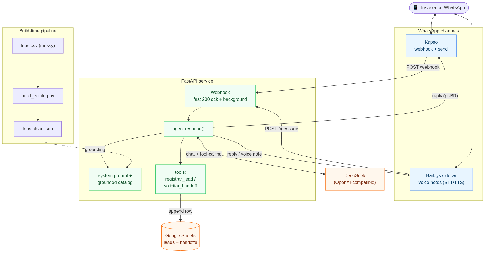
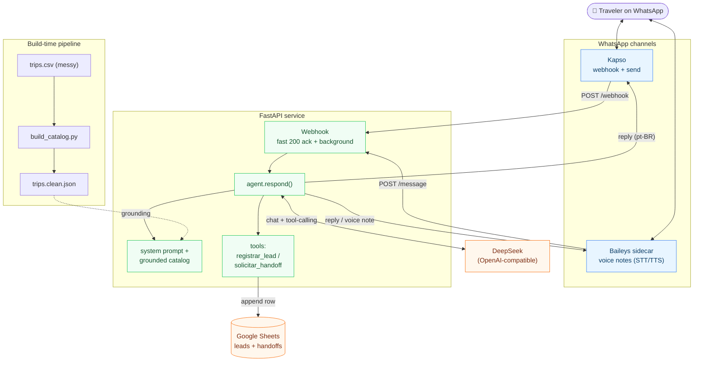

# Dip Your Trip: WhatsApp agent for Brazilian travelers

A conversational agent that meets Brazilian travelers on WhatsApp, in natural
Brazilian Portuguese, about DYT's 5 real trips. It answers **only** from the data
(never invents a price, hotel, place, or date), runs discovery with a few sharp
questions, and when the topic turns to price it captures the lead and hands off to
a human.

> The original challenge brief is in [`CHALLENGE.md`](CHALLENGE.md).
> Design decisions and tradeoffs are in [`DESIGN.md`](DESIGN.md).

## Demo

A real conversation over WhatsApp (Kapso sandbox), and the lead landing live in a
Google Sheet. You can see it work without reading any code.

<p align="center">
  
</p>

The agent does discovery, recommends a grounded trip, **refuses an off-catalog
country (Peru)**, **won't invent a price**, and **captures the lead and hands off**:

> **Viajante:** oi! to pensando numa viagem pro chile mas to meio perdido kkk
> **Agente:** Que legal! Chile é sensacional 😅 O que mais te atrai? Deserto (Atacama), trilhas e natureza (Patagônia), vinho e gastronomia, ou esqui? E quantos dias você tem?
>
> **Viajante:** gosto de trilha mas não sou atleta, tenho uns 8 dias
> **Agente:** Perfeito! O que mais encaixa é o **Trekking na Patagônia chilena**, 7 dias de trilhas lindas num ritmo equilibrado: navegação no Glaciar Grey, Base das Torres (guiada, no seu tempo), depois Puerto Varas com cachoeiras e vulcão…
>
> **Viajante:** vocês têm alguma viagem pro peru também?
> **Agente:** Olha, que pena, a DYT hoje organiza viagens pelo **Chile e Argentina** mesmo. Peru não tá no nosso catálogo, infelizmente 😅
>
> **Viajante:** massa! e quanto custa essa do sul?
> **Agente:** Sobre preço eu não consigo te passar um valor por aqui, o orçamento é **sob medida**. Me passa seu **nome** e um **contato** que já registro e uma pessoa do time te chama com os valores. Pode ser? 😊
>
> **Viajante:** sou o Bastián, meu email é bastian@email.com
> **Agente:** Pronto, Bastián! ✅ Já registrei tudo e uma pessoa do time vai te chamar com os valores e detalhes.

The captured lead and the handoff appear immediately in the Google Sheet
(`user_id` redacted here):

<p align="center">
  
</p>

## Architecture

<p align="center">
  
</p>

<details>
<summary>Diagram source (Mermaid, renders natively on GitHub)</summary>



</details>

- **No RAG.** There are only 5 trips, so the cleaned catalog fits entirely in the
  prompt. That's simpler and more reliable. `scripts/build_catalog.py` turns the
  messy CSV into `data/trips.clean.json`.
- **Isolated channel.** Everything Kapso-specific lives in `app/channels/kapso.py`,
  and the agent only speaks `(user_id, text)`. Swapping channels is just another
  adapter.
- **Swappable LLM provider** via env var (`LLM_PROVIDER`).

## Layout

```
app/
  main.py        FastAPI webhook (Kapso to agent to reply)
  agent.py       LLM loop and tool-calling
  prompt.py      pt-BR persona and grounding rules
  catalog.py     loads the clean catalog as text for the prompt
  tools.py       tool schemas and dispatch
  leads.py       lead/handoff sink (local JSONL plus Google Sheets)
  memory.py      per-number memory (cross-session)
  config.py      env vars (LLM, Kapso, Sheets)
  channels/kapso.py   WhatsApp adapter (parse, signature, send)
scripts/
  build_catalog.py    messy CSV into trips.clean.json
  chat.py             local REPL to talk to the agent
  leads_webapp.gs     Apps Script that receives leads into the Google Sheet
evals/
  cases.py, harness.py, run_evals.py, test_grounding.py
data/
  trips.csv, trips.clean.json
```

## Setup

```bash
python3 -m venv .venv && source .venv/bin/activate
pip install -r requirements.txt
cp env.example .env          # edit .env with your keys
python -m scripts.build_catalog   # generates data/trips.clean.json
```

At minimum, fill in `.env`:

```
LLM_PROVIDER=deepseek
DEEPSEEK_API_KEY=...
```

## Run

**Chat locally (no WhatsApp):**

```bash
python -m scripts.chat
```

**Webhook (to connect to WhatsApp):**

```bash
uvicorn app.main:app --reload --port 8099
```

Expose it with a tunnel and register the URL in Kapso (see below):

```bash
ngrok http 8099    # use the https URL + /webhook in the Kapso dashboard
```

## Connect WhatsApp (Kapso)

1. Create a free [Kapso](https://kapso.ai) account (the free plan includes a
   sandbox number, no Meta setup).
2. In the dashboard, edit the connected number and point the webhook to
   `https://YOUR-TUNNEL/webhook`.
3. Copy the API key (Project Settings → API Keys) into `KAPSO_API_KEY` in `.env`.
4. (Optional, recommended) set `KAPSO_WEBHOOK_SECRET` to validate the
   `X-Webhook-Signature` header.

## See leads from outside (Google Sheets)

1. Open your Google Sheet → Extensions → Apps Script.
2. Paste `scripts/leads_webapp.gs`, change `SECRET`, and deploy as a **web app**
   (access: "Anyone").
3. Put the `/exec` URL in `LEADS_WEBAPP_URL` and the same secret in
   `LEADS_WEBAPP_SECRET` in `.env`.

Without this configured, leads are still recorded locally in
`data/leads.local.jsonl` (fallback).

## Voice notes: a second channel on Baileys

The creative bet is a second, independent WhatsApp channel in
[`baileys/`](baileys/), focused on **voice notes**, since audio is how Brazilians
actually use WhatsApp. It reuses the exact same Python brain through the
channel-neutral `POST /message` endpoint, so nothing about the agent is
duplicated. The Node sidecar only handles the channel and the speech:

<p align="center">
  
</p>

An incoming voice note is transcribed with **Whisper** (STT), the brain answers in
text, and the reply is voiced with **ElevenLabs** TTS (more natural pt-BR voices),
transcoded to opus for WhatsApp. Text messages work the same way without the audio
hops.

Honest tradeoffs: Baileys is unofficial (against WhatsApp ToS, real ban risk) and
needs a dedicated number, so Kapso stays the primary, lower-risk channel and
Baileys is the "if we had another week" bet. Run instructions and the full
tradeoffs are in [`baileys/README.md`](baileys/README.md).

## Evals (proof it doesn't hallucinate)

```bash
python -m evals.run_evals      # report with PASS/FAIL per case
pytest evals/ -v               # as tests
```

The cases attack grounding along the brief's vectors: price (direct and
disguised), off-catalog country, specific date/availability, non-existent hotel,
invented detail, and the ambiguous Ski & Vinho duration.
