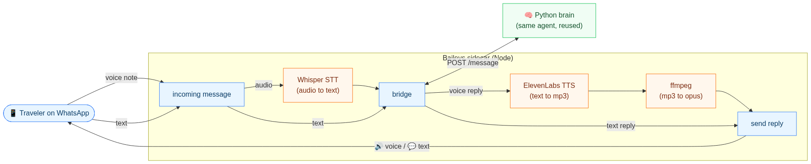
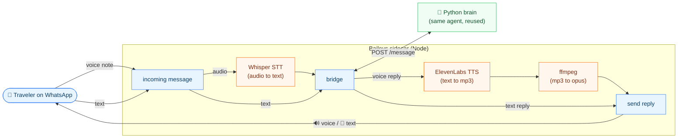

# Baileys channel: alternative WhatsApp adapter with voice notes

This is a **second, independent WhatsApp channel** for the same agent, built on
[Baileys](https://github.com/WhiskeySockets/Baileys) instead of Kapso. It exists
to go deep on the one thing the brief highlights as how Brazilians really use
WhatsApp: **voice notes (audio in and out).**

It reuses the **entire Python brain** (grounding, tools, leads, memory, evals), so
nothing is duplicated. This process is *only* a channel.

<p align="center">
  
</p>

<details>
<summary>Diagram source (Mermaid)</summary>



</details>

## Why it's separate from Kapso (note for reviewers)

We ship **two channels side by side**, on purpose:

- **Kapso** (`app/channels/kapso.py` + `/webhook`) is the primary channel - it's
  what the brief recommends, has zero ban risk, and matches how you test (adding
  your tester number to our sandbox).
- **Baileys** (this folder) is the creative bet: a self-hosted channel with
  **native voice notes**. It talks to the same brain through the channel-neutral
  `POST /message` endpoint.

Honest tradeoffs of the Baileys route:

- ⚠️ **Unofficial** (reverse-engineered WhatsApp Web) → against WhatsApp ToS,
  with real **ban risk** for an automated new number.
- ⚠️ Needs a **dedicated phone number** (QR pairing) and a Node process.
- ⚠️ You'd message **our number directly** (no sandbox tester-number flow).
- ✅ Free, self-hosted, full control, and **audio that feels native** on WhatsApp.

Because of the ban risk, we treat Kapso as the deliverable channel and Baileys as
the "if we had another week, here's the delight" demo.

## Run

Prereq: the Python brain must be running.

```bash
# 1) in the repo root - start the brain
uvicorn app.main:app --port 8099

# 2) here - install and start the sidecar
cd baileys
npm install
npm start          # shows a QR; scan it with the dedicated WhatsApp number
```

Auth state is persisted in `baileys/auth/` (gitignored). After the first pairing
you won't need the QR again.

## Voice notes

Full audio loop for an incoming voice note:

```
voice note → Whisper (STT) → text → Python brain → reply text → TTS → voice note
```

- **STT** (understanding the audio): Whisper, via **Groq** (default, free tier,
  no OpenAI billing) or OpenAI (`STT_PROVIDER`). Both handle pt-BR.
- **TTS** (the reply voice): **ElevenLabs by default** for more natural
  Brazilian-Portuguese voices, with OpenAI TTS as an alternative (`TTS_PROVIDER`).
  ElevenLabs returns mp3, which is transcoded to opus with **ffmpeg** for the
  WhatsApp voice note, so `ffmpeg` must be installed.

If audio isn't fully configured, the channel still works in **text only** and
politely asks audio senders to type.

Relevant env (all in the root `.env`):

```
PYTHON_BRIDGE_URL=http://127.0.0.1:8099
BRIDGE_TOKEN=                 # optional shared secret with the Python /message
STT_PROVIDER=groq             # or "openai"
GROQ_API_KEY=                 # if STT_PROVIDER=groq (Whisper, free tier)
OPENAI_API_KEY=               # if STT_PROVIDER=openai (and/or OpenAI TTS)
TTS_PROVIDER=elevenlabs       # or "openai"
ELEVENLABS_API_KEY=           # if TTS_PROVIDER=elevenlabs
ELEVENLABS_VOICE_ID=          # pick a pt-BR voice from your ElevenLabs library
# ELEVENLABS_MODEL=eleven_multilingual_v2
# STT_MODEL=                  # default: whisper-large-v3-turbo (groq) / whisper-1 (openai)
# TTS_MODEL=gpt-4o-mini-tts   # OpenAI TTS fallback
# TTS_VOICE=nova
```

## Files

```
src/index.js    Baileys connection, QR, reconnection, message handler
src/bridge.js   HTTP bridge to the Python brain (POST /message)
src/audio.js    STT (Whisper) + TTS (ElevenLabs / OpenAI), ffmpeg transcode
src/config.js   loads the root .env and exposes config
```
